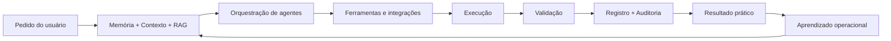

# JOS — Jair Operating System

**Sistema pessoal de inteligência operacional, memória, RAG, agentes e automação.**

O JOS transforma solicitações em contexto, planejamento, execução, validação e registro. O projeto combina memória estruturada, RAG, agentes especializados, workflows, governança, auditoria, observabilidade e integrações.

> **Status:** projeto ativo e em evolução contínua. Os indicadores abaixo são métricas internas de engenharia e não equivalem a certificação independente.

## Mapa mental do sistema

## Capacidades demonstradas

- Memória contextual e recuperação de conhecimento.
- RAG híbrido com avaliação de qualidade.
- Orquestração de agentes e workflows.
- Política de aprovação por nível de risco.
- Auditoria e rastreabilidade de execuções.
- Integrações com serviços externos.
- Observabilidade, resiliência e autoavaliação.
- Automação aplicada a educação, documentos, projetos e operações pessoais.

## Indicadores internos — 14/09/2026

| Indicador | Resultado |
|---|---:|
| Score global de maturidade enterprise | **7,49 / 10** |
| Auditoria AgentOps | **92 / 100** |
| Contratos de agentes | **72 / 72 aprovados** |
| RAG — MRR | **0,9556** |
| RAG — Hit@5 | **0,9704** |
| RAG — groundedness | **1,00** |
| RAG — faithfulness | **1,00** |
| RAG — correção de resposta | **0,9208** |
| Alucinações de alto risco nos casos avaliados | **0** |

## Pontos fortes atuais

Arquitetura modular, memória contextual, RAG, governança de identidade, contratos automatizados, rastreabilidade e integração entre decisão e execução.

## Áreas em evolução

Certificação empírica de agentes, execução ponta a ponta com maior taxa de sucesso, escalabilidade horizontal, cobertura de evidência e redução de dependências legadas.
## Segurança

Este repositório é uma versão **sanitizada para portfólio**. Não contém credenciais, tokens, dumps de banco, dados pessoais, endpoints administrativos nem código operacional sensível.

Consulte [SECURITY.md](SECURITY.md).

## Documentação

- [Arquitetura](docs/architecture.md)
- [Maturidade e evidências](docs/maturity.md)
- [Roadmap](docs/roadmap.md)
- [Métricas públicas](public-metrics.json)

## Estudos de caso

- [Jair Didática — geração e validação de materiais](docs/case-studies/01-jair-didatica.md)
- [Agentic RAG e Governança](docs/case-studies/02-agentic-rag.md)
- [Operações Assistidas no Desktop](docs/case-studies/03-operacoes-desktop.md)
- [Runtime Local e Resiliência](docs/case-studies/04-runtime-local.md)

## Autor

Projeto concebido e desenvolvido por **Jair Pimenta**, com apoio de ferramentas de IA, automação e engenharia assistida.
